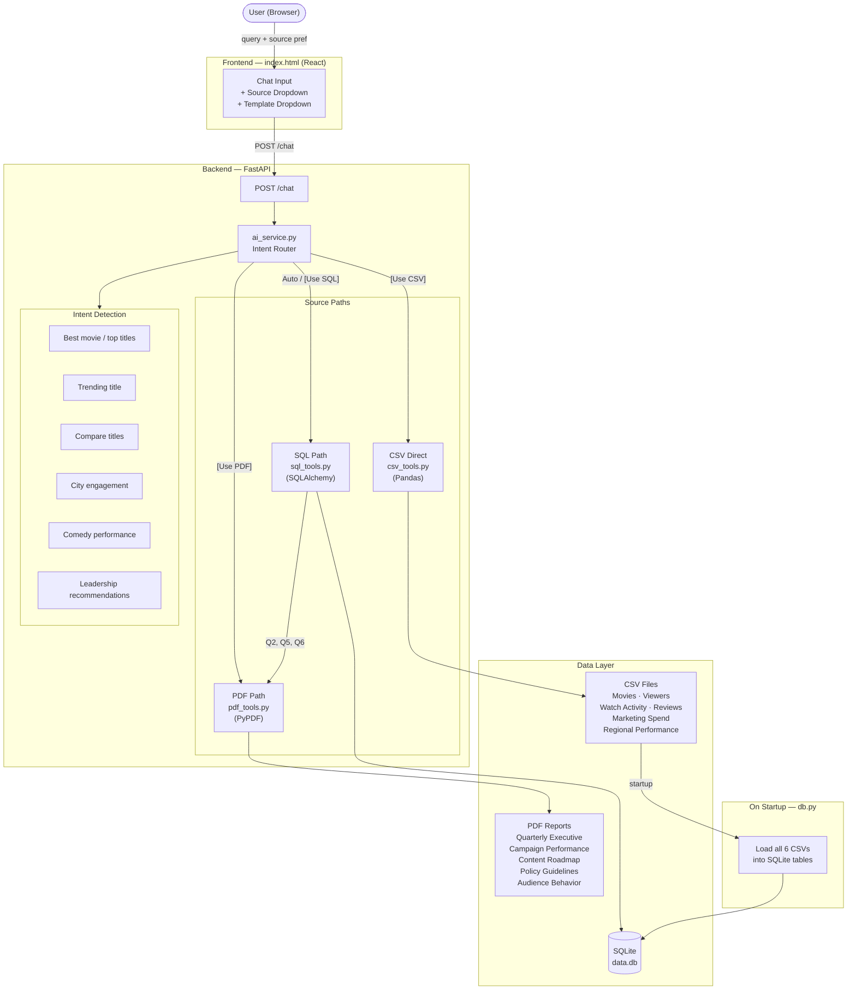

# AI Insights Assistant

AI Insights Assistant is a full-stack app that answers natural language questions about streaming content performance using three data sources:

- SQL (SQLite) for structured queries across movies, viewers, watch activity, reviews, marketing spend, and regional performance
- PDF reports for unstructured executive and campaign insights
- CSV files read directly with Pandas for analytics (alternative to SQL, user-selectable)

The backend is built with FastAPI and the frontend is a lightweight HTML/React interface.

## Features

- Multi-source query answering across SQL, PDF, and CSV
- Intent-based routing for six supported question types
- User-selectable source: Auto Route, CSV Direct, SQL, or PDF via the UI dropdown
- Source-aware responses with data payloads
- All six database tables auto-loaded from CSV on backend startup
- "Best movie" query returns the single highest-rated title; "best in 2025" returns a ranked list
- Genre distribution chart via API endpoint
- Template dropdown in the UI for all six required questions

## Supported Questions

| Question | Data Source |
|---|---|
| Which titles performed best in 2025? | SQL |
| Why is Stellar Run trending recently? | SQL + PDF |
| Compare Dark Orbit vs Last Kingdom | SQL |
| Which city had the strongest engagement last month? | SQL |
| What explains weak comedy performance? | SQL + PDF |
| What recommendations would you give for leadership? | PDF + SQL |

## Architecture Diagram



## How It Works

1. The frontend sends a query to `POST /chat`. The source preference dropdown prepends `[Use CSV]`, `[Use SQL]`, or `[Use PDF]` to the query when not set to Auto Route. Selecting a template overrides whatever is typed in the input field.
2. The backend detects the source override first:
   - `[Use CSV]` → reads CSV files directly with Pandas (`csv_tools.py`)
   - `[Use PDF]` → searches PDF sections only
   - Auto Route / `[Use SQL]` → queries SQLite + PDF where relevant
3. Within each source path, intent is detected by keyword:
   - Comedy keywords → comedy analysis
   - Compare / vs → side-by-side title comparison
   - "Best movie" (no year) → single highest-rated title
   - Best / top + year → ranked list filtered by year
   - Trending / trend → trending score lookup
   - City / engagement / region → regional performance
   - Recommend / leadership / strategy → executive recommendations (PDF + SQL)
   - Anything else → PDF section search, then fallback
4. The backend formats the answer and includes a source label (`SQL Database`, `CSV Direct`, `PDF Documents`, `SQL + PDF`, etc.).

## Project Structure

```text
ai-assistant/
├── backend/
│   ├── main.py
│   ├── db.py
│   ├── init_db.py
│   ├── security.py
│   ├── services/
│   │   ├── ai_service.py
│   │   └── hf_service.py
│   └── tools/
│       ├── __init__.py
│       ├── csv_tools.py
│       ├── pdf_tools.py
│       └── sql_tools.py
├── data/
│   ├── movies.csv
│   ├── viewers.csv
│   ├── watch_activity.csv
│   ├── reviews.csv
│   ├── marketing_spend.csv
│   ├── regional_performance.csv
│   ├── generate_movies.py
│   ├── generate_pdfs.py
│   └── pdfs/
│       ├── quarterly_executive_report.pdf
│       ├── campaign_performance_summary.pdf
│       ├── content_roadmap.pdf
│       ├── policy_guidelines.pdf
│       ├── audience_behavior_report.pdf
│       └── report.pdf
├── frontend/
│   └── index.html
├── .env.example
├── .gitignore
├── docker-compose.yml
├── Dockerfile
├── requirements.txt
└── README.md
```

## Setup

### Option A — Local

1. Create and activate a virtual environment:

```bash
python -m venv backend/venv
source backend/venv/bin/activate
```

2. Install dependencies:

```bash
pip install -r requirements.txt
```

3. Create your environment file:

```bash
cp .env.example .env
```

Edit `.env` and fill in your values (see [Environment Variables](#environment-variables)).

### Option B — Docker

```bash
cp .env.example .env   # fill in your values
docker-compose up --build
```

Backend runs at `http://localhost:8000`, frontend at `http://localhost:5500`.

## Running the Backend

Run from the project root (not from inside `backend/`):

```bash
uvicorn backend.main:app --reload
```

The backend starts at `http://127.0.0.1:8000` and automatically loads all six CSV tables into SQLite on startup.

## Running the Frontend

Open `frontend/index.html` directly in your browser, or serve it:

```bash
cd frontend
python -m http.server 5500
```

Then open `http://localhost:5500`.

## Database Initialization

On startup, `db.py` loads all six CSV files into SQLite tables:

| Table | Source CSV |
|---|---|
| `movies` | `data/movies.csv` |
| `viewers` | `data/viewers.csv` |
| `watch_activity` | `data/watch_activity.csv` |
| `reviews` | `data/reviews.csv` |
| `marketing_spend` | `data/marketing_spend.csv` |
| `regional_performance` | `data/regional_performance.csv` |

The database file (`backend/data.db`) is excluded from git. Each restart recreates all tables from the CSVs.

## Regenerating Data

To regenerate the PDF reports:

```bash
python data/generate_pdfs.py
```

## Security

| Mechanism | Detail |
|---|---|
| API key auth | Set `API_KEY` in `.env`; supply as `X-API-Key` header. If unset, auth is skipped (dev mode). |
| Rate limiting | 30 requests/minute per IP via `slowapi` |
| Input validation | Max 500 chars, blocks SQL injection patterns (`DROP`, `--`, `<script>`, etc.) |
| CORS | Restricted to `ALLOWED_ORIGINS` env var (defaults to localhost only) |
| Security headers | `X-Content-Type-Options`, `X-Frame-Options`, `Referrer-Policy` on every response |

Example authenticated request:

```bash
curl -X POST http://localhost:8000/chat \
  -H "Content-Type: application/json" \
  -H "X-API-Key: your_secret_api_key_here" \
  -d '{"query": "Which titles performed best in 2025?"}'
```

### Generating an API Key

Use Python to generate a cryptographically secure random key:

```bash
python -c "import secrets; print(secrets.token_hex(32))"
```

This outputs a 64-character hex string, for example:

```
a3f8c2e1d4b7f9a0e5c8d2b1f4a7e3c6d9b2f5a8e1c4d7b0f3a6e9c2d5b8f1a4
```

Copy it into your `.env` file:

```env
API_KEY=a3f8c2e1d4b7f9a0e5c8d2b1f4a7e3c6d9b2f5a8e1c4d7b0f3a6e9c2d5b8f1a4
```

**Rules:**
- Never commit `.env` to git (already excluded by `.gitignore`)
- Don't reuse this key for other services
- For production, store it in a secrets manager (AWS Secrets Manager, GitHub Secrets, etc.) rather than a flat file
- Rotate it periodically

## Environment Variables

| Variable | Required | Description |
|---|---|---|
| `HF_API_KEY` | Optional | HuggingFace token for AI answer generation. Without it, structured answers are returned directly. |
| `API_KEY` | Optional | Protects all endpoints. Leave blank to disable auth in dev. |
| `ALLOWED_ORIGINS` | Optional | Comma-separated CORS origins. Defaults to `http://localhost:5500,http://127.0.0.1:5500`. |

## API Endpoints

All endpoints (except `/` and `/health`) require `X-API-Key` header when `API_KEY` is set.

| Method | Path | Description |
|---|---|---|
| `GET` | `/` | Backend status |
| `GET` | `/health` | Health check + env flag status |
| `GET` | `/movies` | All movie rows from SQLite |
| `POST` | `/chat` | Main AI query endpoint (rate limited: 30/min) |
| `POST` | `/ingest` | Reload all CSV files into SQLite |
| `GET` | `/chart` | Genre distribution chart (PNG) |

Example request:

```json
{
  "query": "Which titles performed best in 2025?"
}
```

## AI Layer

The system uses HuggingFace's `flan-t5-base` model for answer generation:

1. Query intent is detected and routed to the appropriate data tool (SQL / CSV / PDF)
2. The tool retrieves structured data and formats a context string
3. The context + question are passed to `flan-t5-base` via the HuggingFace Inference API
4. The model generates a natural language answer
5. If HuggingFace is unavailable (no key, timeout, error), the structured answer is returned directly as a fallback

## Tech Stack

- FastAPI + slowapi (rate limiting)
- SQLite + SQLAlchemy
- Pandas
- Matplotlib
- PyPDF
- ReportLab (PDF generation)
- HuggingFace Inference API (flan-t5-base)
- Python dotenv
- Docker + nginx
- HTML / CSS / React (via CDN)

## Known Limitations

- PDF retrieval is lexical/token-based, not embedding-based semantic search
- Intent routing uses keyword matching, not an NLP classifier
- Database is fully reloaded from CSV on every backend restart

## Notes on Assumptions / Tradeoffs

### Data
- **Synthetic dataset** — all CSV and PDF data is randomly generated for demo purposes. Titles, ratings, views, and regional figures do not reflect real-world streaming data.
- **CSV as both source and seed** — CSVs serve two roles: they are loaded into SQLite at startup (SQL path) and also read directly by Pandas (CSV path). This is intentional to demonstrate both access patterns as required, but it means the same underlying data is queried twice in different ways.
- **Static data** — there is no ingestion pipeline. Updating the data means editing the CSV files and restarting the backend.

### Routing
- **Keyword matching over NLP** — intent detection uses simple string matching (e.g. "comedy", "trending", "compare"). This is fast and dependency-free but will misroute ambiguous or phrased-differently queries. A classifier or LLM-based router would be more robust.
- **Routing order matters** — comedy is checked before "perform/best" to avoid "comedy performance" triggering the wrong branch. This ordering is fragile; adding new intents requires careful placement.
- **Template overrides typed input** — when a template is selected in the UI, it completely replaces whatever the user typed. This is a deliberate UX simplification but can be confusing when both fields are filled.
- **"Best movie" vs "best titles"** — a query with no year returns the single highest-rated title; a query specifying a year returns a ranked list. This distinction is based on keyword presence, not true semantic understanding.

### Storage
- **SQLite over a client-server DB** — chosen for zero-config local setup. It has no concurrent write support and is not suitable for production-scale data or multi-user deployments.
- **DB rebuilt on every restart** — the database is dropped and recreated from CSVs each time the backend starts. This keeps data in sync with the files but means any manual DB edits are lost and startup is slightly slower as datasets grow.

### PDF Retrieval
- **Lexical scoring over embeddings** — PDF sections are ranked by token overlap with the query. Synonyms and paraphrased questions will score zero even if semantically relevant. Embedding-based retrieval (e.g. with `sentence-transformers`) would handle this better but adds model dependencies.
- **PDFs re-read on every query** — there is no pre-built index. Each search re-parses all PDF files from disk. Acceptable for five small files; would need caching or a vector store at scale.

### Frontend
- **No build step** — React and Babel are loaded from CDN. This avoids a Node.js dependency for a demo but is not suitable for production (no bundling, no tree-shaking, slower initial load).
